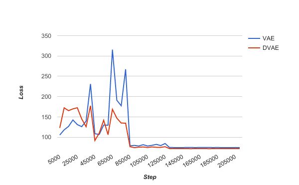
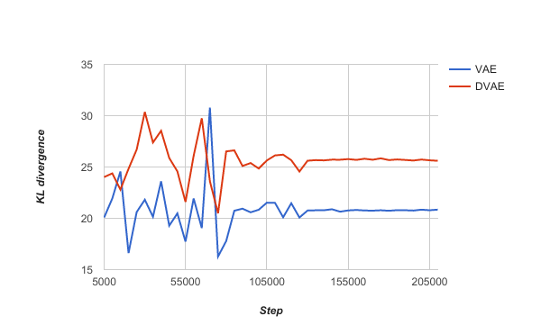
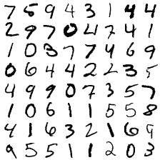
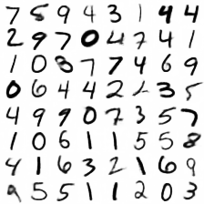
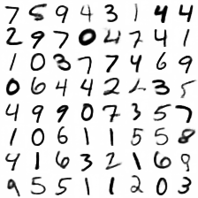
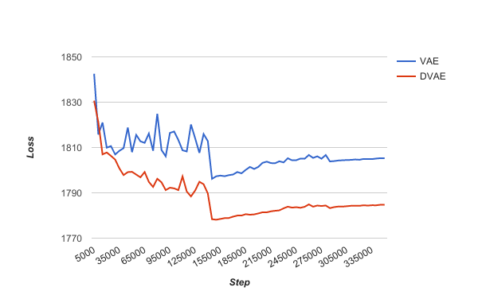
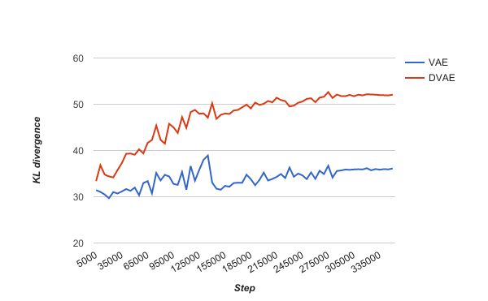
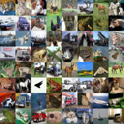
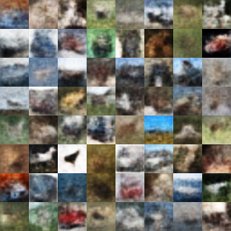
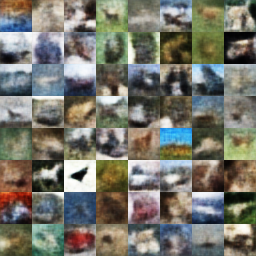

# Denoising Variational Autoencoder

## Overview

The purpose of this project is to compare a different method of applying
denoising criterion to a variational autoencoder model. A slightly different
approach has previously been implemented as an explicit corruption of the input
as would be done for a traditional denoising autoencoder (DAE), but applied
it to a variational autoencoder (VAE) (Im et al., 2016 \[[1]\]). In this
project the output of the generative network of the VAE is treated as a
distorted input for the DAE, with the loss propogated back to the VAE, which is
referred to as the denoising variational autoencoder (DVAE).

## Methods

This project was created in [Tensorflow] ([version 0.12.1](https://github.com/tensorflow/tensorflow/releases/tag/0.12.1)) partly as a way to
familiarize myself with it. [Tensorflow] should be the only requirement for
running the underlying code.

### Datasets
There are two test datasets used for this project, the [MNIST] dataset and the
[CIFAR-10] dataset.

### Models
For both the VAE and the DAE the recognition model is composed of a
convolutional neural network (CNN) with a batch normalization layer before each
activation function. The generative model similarly uses batch normalization,
but is a deconvolutional network (DN). The VAE uses a latent space of 50
samples for the [MNIST] dataset and 100 samples for the [CIFAR-10] dataset.

### Training procedure
The input from the dataset is feed into a VAE. The variational lower bound is
optimized to minimize the KL-divergence (KLD) along with the expected
reconstruction error. The output of the generative network of the VAE is then
fed to a DAE which treats the generated image as a distorted input and tries to
minimize the reconstruction error based on the original input.

The joint optimization of these two networks results in the loss propagating
from the DAE to the VAE to help drive down the variational lower bound.

## Results
In order to determine if adding a denoising criterion improved performance, the
normal VAE was compared to the DVAE. This was performed on both datasets.

For the [MNIST] dataset there are 60000 training images, of which 6000 were
used as a hold out validation set, and there are 10000 test images.

For the [CIFAR-10] dataset there are 50000 training images, of which 5000 were
used as a hold out validation set, and there are 10000 test images.

**Model Loss and KL-divergence**

| Model |  Dataset | Samples | Testing Loss | Testing KLD |
|:------|:---------|--------:|-------------:|------------:|
|  VAE  |   MNIST  | 1       | 74.248       | 20.900      |
| DVAE  |   MNIST  | 1       | 71.648       | 25.728      |
|  VAE  |   MNIST  | 5       | 68.786       | 14.333      |
| DVAE  |   MNIST  | 5       | 65.132       | 19.581      |
|  VAE  | CIFAR-10 | 1       | 1811.562     | 35.668      |
| DVAE  | CIFAR-10 | 1       | 1790.816     | 52.144      |
|  VAE  | CIFAR-10 | 5       | 1787.758     | 24.735      |
| DVAE  | CIFAR-10 | 5       | 1783.657     | 35.619      |

As an additional way to measure performance of the resultant models a separate
CNN classification model was generated using a softmax activation and the cross
entropy loss. The images generated from the VAE and DVAE were fed to the
classification model to determine the classification error rate of the two
autoencoder networks.

**CNN Classification Error**

|  Dataset | Testing Error Rate |
|:---------|-------------------:|
|   MNIST  | 1.01%              |
| CIFAR-10 | 22.23%             |

**Generated Image Classification Error**

| Model |  Dataset | Samples | Testing Error Rate |
|:------|:---------|--------:|-------------------:|
|  VAE  |   MNIST  | 1       | 3.85%              |
| DVAE  |   MNIST  | 1       | 2.99%              |
|  VAE  |   MNIST  | 5       | 2.16%              |
| DVAE  |   MNIST  | 5       | 1.66%              |
|  VAE  | CIFAR-10 | 1       | 71.84%             |
| DVAE  | CIFAR-10 | 1       | 70.61%             |
|  VAE  | CIFAR-10 | 5       | 71.76%             |
| DVAE  | CIFAR-10 | 5       | 70.61%             |

#### MNIST
Here are the graphs of the loss and KL divergence on the validation set over
time during training of the VAE and DVAE models on the MNIST dataset
(***samples=1***):

**MNIST Loss**

**MNIST KL Divergence**

These are example inputs and outputs from the VAE and DVAE models on the
testing dataset (***samples=1***):

| Input       | VAE Output | DVAE Output |
|:------------|------------|-------------|
|  |   |   |

#### CIFAR-10
Here are the graphs of the loss and KL divergence on the validation set over
time during training of the VAE and DVAE models on the CIFAR-10 dataset
(***samples=1***):

**CIFAR-10 Loss**

**CIFAR-10 KL Divergence**

These are example inputs and outputs from the VAE and DVAE models on the
CIFAR-10 testing dataset (***samples=1***):

| Input          | VAE Output   | DVAE Output   |
|:---------------|--------------|---------------|
|  |  |  |

## Conclusion

By looking at the results it is clear that there is contention between reducing
the KLD and reducing the overall loss. This is apparent in the fact that the
loss for the DVAE model is lower than the loss for the VAE model, while the KLD
for the DVAE model is higher than it is for the VAE model.

The reasons for this discrepancy is likely due to the unimodal nature of the
Gaussian distribution used as the basis for determining the KLD. Since the
distribution may only be centered around a single point the only way to make
the model more accurately recreate the input is to force the KLD to increase.
Rather it seems that adding additional clusters through the use of a Gaussian
Mixture Model as the basis for generating the prior may allow a reduction in
the model loss with while also reducing the KLD (Dilokthanakul et al., 2017
\[[2]\]).

## References

<cite>Dilokthanakul, Nat, et al. "Deep Unsupervised Clustering with Gaussian Mixture Variational Autoencoders." arXiv preprint arXiv:1611.02648 (2016).</cite>

<cite>Im, Daniel Jiwoong, et al. "Denoising criterion for variational auto-encoding framework." arXiv preprint arXiv:1511.06406 (2015).</cite>

[MNIST]: http://yann.lecun.com/exdb/mnist/
[CIFAR-10]: https://www.cs.toronto.edu/~kriz/cifar.html
[Tensorflow]: https://www.tensorflow.org
[1]: https://arxiv.org/abs/1511.06406
[2]: https://arxiv.org/abs/1611.02648
